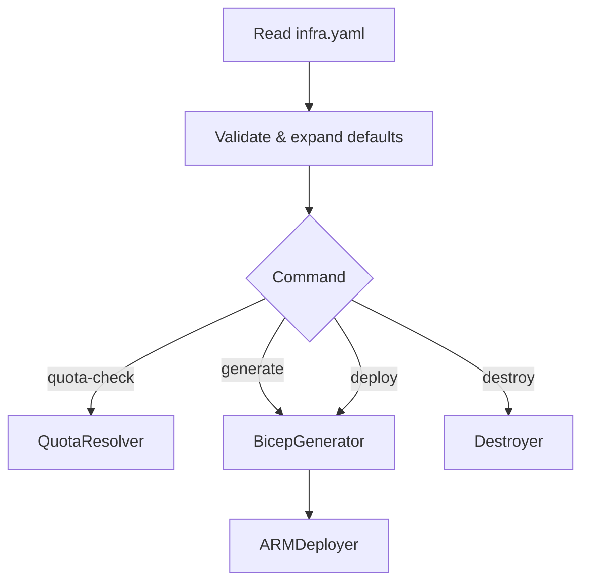

# Implementation Plan – Deployer (Quota‑Aware Bicep Generator & Region‑Selector)

*Target language: ****Python ≥3.11**** (single‑file script); execution via ****`uv run`****.*

---

## 1 Objective

Deliver a proof‑of‑concept CLI (`deployer.py`) that reads `infra.yaml`, performs quota validation, auto‑selects a region, generates Bicep + parameters files, and optionally deploys or destroys the stack. The script must:

1. Rely only on widely‑available PyPI packages so it can be executed with **`uv run python deployer.py <cmd>`** without manual environment prep.
2. Keep all logic in one file (easier audit; PoC constraint).
3. Shell out to **Azure CLI** for all ARM/quota interactions (no bespoke SDK auth needed).
4. Encode spec‑driven behaviours: rollback, orphan warnings, SemVer parsing, etc.

---

## 2 Technology Notes

| Concern                      | Choice                         | Rationale                                                                                                                                                                           |   |                                                                                                                                                                                         |                                                                   |
| ---------------------------- | ------------------------------ | ----------------------------------------------------------------------------------------------------------------------------------------------------------------------------------- | - | --------------------------------------------------------------------------------------------------------------------------------------------------------------------------------------- | ----------------------------------------------------------------- |
| **Package manager / runner** | `uv run`                       | `uv` (by Astral) bootstraps an ephemeral, caching virtualenv, resolves dependencies declared **inline in deployer.py**, and streams execution. Keeps onboarding friction near‑zero. |   | `uv` (by Astral) bootstraps an ephemeral, caching virtualenv, resolves dependencies via **PEP 665 lockfiles** when present, and streams execution. Keeps onboarding friction near‑zero. |                                                                   |
| **CLI parsing**              | `argparse` (stdlib)            | Avoids extra deps.                                                                                                                                                                  |   |                                                                                                                                                                                         |                                                                   |
| **YAML**                     | `PyYAML >=6`                   | Ubiquitous; wheels available for macOS, Linux, Win via uv’s resolver.                                                                                                               |   |                                                                                                                                                                                         |                                                                   |
| **Colored output**           | `rich`                         | Required for human‑friendly tables and spinners. Fallback logic is **out of scope** for the PoC.                                                                                    |   | `rich`                                                                                                                                                                                  | Great UX for status tables / warnings but optional; guard import. |
| **Templating**               | `jinja2`                       | Lightweight; single `default.bicep.j2` plus resource‑specific templates.                                                                                                            |   |                                                                                                                                                                                         |                                                                   |
| **Schema validation**        | Hand‑rolled checks (10‑15 LOC) | Full JSON‑Schema heavy for PoC; simple asserts suffice.                                                                                                                             |   |                                                                                                                                                                                         |                                                                   |

**Dependency stanza (inline at top of script):**

```python
# Requirements for uv: pyyaml>=6 rich>=13 jinja2>=3
```

`uv run -- python deployer.py generate ...` will install these automatically.

---

## 3 High‑Level Architecture



> Each block is an **internal class** inside `deployer.py`; keep them small (<150 LOC each).

---

## 4 Detailed Component Checklist

### 4.1 `InfraManifest` (≈ 120 LOC)

* Load YAML → dict.
* Apply inheritance rules (region, tags, keyVault).
* Expand `services[*].effective_region` per §3.
* Coerce `deployment.rollback` to enum \[`none`, `lastSuccessful`].
* Simple `validate()` raising `ManifestError` on structural issues.

### 4.2 `QuotaResolver` (≈ 160 LOC)

* Method `check(manifest) -> dict` returning `{status, candidate_regions, selection}`.
* For each tuple `(provider, unit, required, region)` shell out:

  ```bash
  az quota list --location <region> --resource-type <provider> -o json
  ```

  Parse `totalUsage` vs `limit`.
* Build a `defaultdict(list)` of passing regions.
* Intersect sets for shared‑region services; detect **impossible** condition.
* Write `region-analysis.json` (Rich table preview if available).
* On `--auto-select` choose first viable region or fail code 2.

### 4.3 `BicepGenerator` (≈ 180 LOC)

* Templates embedded as a Python `TEMPLATES` dict (multi‑line Jinja2 strings) inside `deployer.py`; no filesystem lookups.
* For each service:

  * Pick `<type>.bicep.j2` if present else `default.bicep.j2`.
  * Render via Jinja2 with service props & manifest tags.
* Concatenate module `main.bicep` and emit `main.parameters.json` stub.
* **Orphan detection:**

  ```bash
  az resource list --resource-group <rg> --query "[].{id:id, type:type}" -o json
  ```

  Compare to planned resource IDs; print yellow Rich warning block.

### 4.4 `ARMDeployer` (≈ 120 LOC)

* Build CLI args:

  ```bash
  az deployment sub create --location <region> \
    --name <metadata.name> \
    --template-file main.bicep \
    --parameters @main.parameters.json \
    --rollback-on-error
  ```
* Stream `subprocess.Popen` stdout/stderr; exit on non‑zero.

### 4.5 `Destroyer` (≈ 90 LOC)

* Prompt user confirmation (`--yes` to skip).
* **Hard‑coded tier deletion order** to avoid dependency errors:

  1. **Data** – PostgreSQL flexible server (+ firewall rules)
  2. **Compute / Registry** – Container Apps environment, container apps, Azure Container Registry
  3. **Identity / Secrets** – Key Vault (soft‑delete, purge protection ignored)
  4. **Monitoring** – Log Analytics workspace
  5. **Static Web** – Static Web App
  6. **Resource Group** – final catch‑all `az group delete` (best‑effort; prints warning if KV purge protection blocks immediate deletion)
* Skip purge‑protection handling (out of scope).

### 4.6 Helpers & Common Helpers & Common

* `run(cmd: list[str]) -> str` – wraps `subprocess.check_output` with Rich live spinner.
* `fatal(msg, code)` – prints red msg, exits.
* `JsonEncoderExtended` – handle datetimes / enums.

---

## 5 Command‑Line UX

```text
Usage: python deployer.py <command> [options]
Commands:
  quota-check   Validate quotas & optionally auto‑select region.
  generate      Produce Bicep & parameter files.
  deploy        quota-check + generate + ARM deploy.
  deploy --prune  As above, but delete orphans.
  destroy       Tear everything down.
Global opts:
  -c, --config <path>   Path to infra.yaml (default ./infra.yaml)
  --auto-select         Pick first OK region without prompt
  -v, --verbose         Debug logging
```

---

## 6 Development Roadmap (for coding agent)

| Phase                           | Effort | Deliverables                                                     |
| ------------------------------- | ------ | ---------------------------------------------------------------- |
| **0** – Scaffolding             | ½ day  | `deployer.py` skeleton, argparse, InfraManifest load/validate.   |
| **1** – QuotaResolver MVP       | 1 day  | `quota-check` command; mock data fixtures for offline test.      |
| **2** – Bicep templates         | 1 day  | Template folder, default module, `generate` command integration. |
| **3** – Deploy & Rollback       | 1 day  | ARMDeployer, `deploy` command incl. rollback flag.               |
| **4** – Orphan warnings & prune | ½ day  | Diff logic; `--prune` stub (delete).                             |
| **5** – Destroy command         | ½ day  | Reverse delete, confirmation flow.                               |
| **6** – Polish & Docs           | ½ day  | README with uv usage, Rich styling, CI lint.                     |

Total ≈ 5 work‑days for an experienced engineer.

---

## 7 Testing Strategy (PoC scope)

Automated unit/integration tests are **out of scope** for this proof‑of‑concept. Verification will be performed manually by running:

```bash
uv run -- python deployer.py deploy --auto-select
```

and inspecting the Azure portal to confirm that all resources provision successfully. A future iteration may introduce pytest and CI automation, but that is explicitly deferred.

---

## 8 Deliverables

1. `deployer.py` – 600–700 LOC single file.
2. (Templates are embedded inside `deployer.py`; no external template folder.)
3. `README.md` – getting‑started (incl. `uv` install snippet).
4. `.github/workflows/ci.yaml` – lint + unit.
5. `examples/infra.yaml` – minimal manifest for demo.

---

## 9 Future Enhancements (beyond PoC)

* Extract core modules into package; provide entry‑point via `console_scripts`.
* Replace shell `az` calls with `azure-mgmt*` SDK for finer control.
* Add JSON‑Schema validation with `pydantic`.
* Telemetry sink choice per Outstanding Issue 14.
* Plugin architecture for new resource types (importlib metadata).

---

### “Hello World” with uv

```bash
# One‑liner to test everything
uv run -- python deployer.py deploy --auto-select
```

`uv` will create a local cache (`~/.cache/uv`) of wheel downloads, spin up a temp virtualenv, install `pyyaml`, `rich`, `jinja2`, and run the script – perfect for laptop or CI.

---

> **Recap** – This plan maps each spec requirement to a concrete Python function/class, sets a five‑day schedule, and leverages **uv run** to keep environment setup trivial. A capable coding agent can now work sequentially through the checklist and ship a runnable PoC.

---
